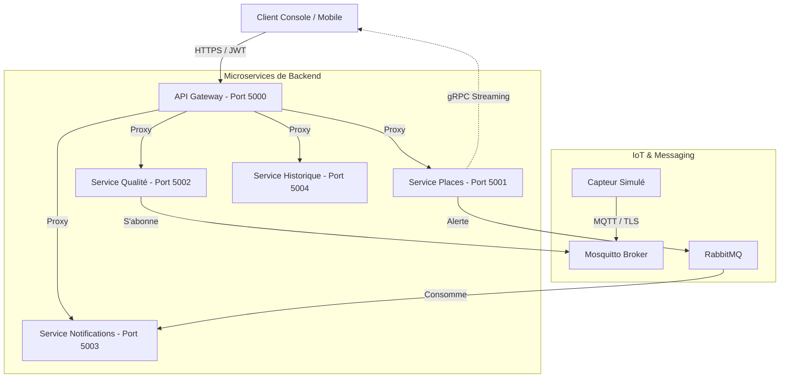

# 🅿️ ParkingProject : Système de Gestion Intelligent IoT

Ce projet est une solution complète de gestion de parking intelligent basée sur une architecture **microservices**. Il intègre des technologies IoT, des communications asynchrones (RabbitMQ, MQTT), du streaming (gRPC) et une sécurité avancée (JWT, TLS).

## 🏗️ Architecture du Système

Le système est composé de plusieurs services spécialisés communiquant ensemble pour offrir une expérience fluide.



## 🚀 Composants Clés

### 1. [API Gateway](file:///c:/Users/PROBOOK/Desktop/M1%20S2/SOA/TPs%20SOA/Projets/TP12-API-Gateway/ApiGateway)
*   **Rôle** : Point d'entrée unique.
*   **Fonctionnalités** : Routage, Authentification JWT, Validation de clé API, Limitation de débit (Rate Limiting).
*   **Endpoints** : `/api/places`, `/api/qualite`, `/api/notif`.

### 2. [Service Places](file:///c:/Users/PROBOOK/Desktop/M1%20S2/SOA/TPs%20SOA/Projets/TP9-ParkingIoT/ServicePlaces)
*   **Rôle** : Gère l'état des places de parking.
*   **Technologie** : gRPC Streaming pour l'envoi en temps réel des disponibilités aux clients.

### 3. [Service Qualité](file:///c:/Users/PROBOOK/Desktop/M1%20S2/SOA/TPs%20SOA/Projets/TP12-API-Gateway/ServiceQualite)
*   **Rôle** : Analyse les données environnementales (Co2, Température) reçues des capteurs.
*   **Communication** : Client MQTT s'abonnant au broker Mosquitto.

### 4. [Service Notifications](file:///c:/Users/PROBOOK/Desktop/M1%20S2/SOA/TPs%20SOA/Projets/TP12-API-Gateway/ServiceNotifications)
*   **Rôle** : Envoie des notifications/alertes.
*   **Communication** : Consommateur RabbitMQ recevant les événements de `Service Places`.

### 5. [Capteur Simulé](file:///c:/Users/PROBOOK/Desktop/M1%20S2/SOA/TPs%20SOA/Projets/TP8-ParkingIoT/CapteurSimule)
*   **Rôle** : Simule un équipement IoT qui publie des données de capteurs via MQTT chiffré (TLS).

## 🛠️ Stack Technique
*   **Framework** : .NET 8 / ASP.NET Core
*   **Messaging** : RabbitMQ, Mosquitto (MQTT)
*   **Communication** : REST, gRPC
*   **Sécurité** : JWT (JSON Web Token), TLS/SSL, API Keys
*   **Langage** : C#

## 🏁 Démarrage Rapide

### Prérequis
1.  **Docker** (pour RabbitMQ et Mosquitto) ou installations locales.
2.  **.NET SDK 8.0+**.
3.  **Certificats TLS** (pour la communication MQTT sécurisée).

### Installation
1.  Lancer le broker MQTT (Mosquitto) avec support TLS.
2.  Lancer RabbitMQ.
3.  Exécuter les microservices :
    ```powershell
    dotnet run --project ./TP12-API-Gateway/ApiGateway
    dotnet run --project ./TP9-ParkingIoT/ServicePlaces
    # ... ainsi de suite pour chaque service
    ```

### Test de Résilience
Un script PowerShell est disponible pour tester la tolérance aux pannes :
*   [test_resilience.ps1](file:///c:/Users/PROBOOK/Desktop/M1%20S2/SOA/TPs%20SOA/Projets/TP12-API-Gateway/test_resilience.ps1)

## 🔒 Sécurité
Toutes les requêtes vers les services internes doivent passer par la Gateway avec un token JWT valide ou une clé API autorisée. La communication IoT est protégée par MQTTS (Port 8883).

---
*Projet réalisé dans le cadre du module Services Orientés Architecture (SOA).*
